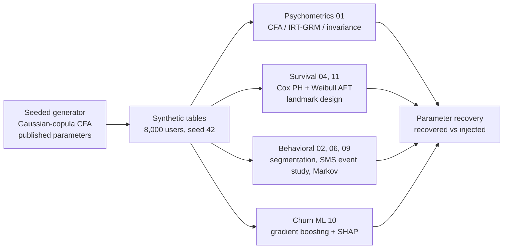

# Digital-health survival casebook

[](https://github.com/brittanyreese/digital-health-survival-casebook/actions/workflows/ci.yml)


[](https://github.com/astral-sh/ruff)

A methods casebook for digital-health survival analysis, built on a **fully synthetic** smoking-cessation cohort for the Acme quit-support program, an app from the fictional vendor Acme Health. No real participant data exists in this project; all organizations, programs, and people are fictitious, and any resemblance to real studies or products is coincidental. Every dataset is generated by a committed, seeded simulation whose parameters are drawn from published literature and public federal data (NHANES, MMWR), so every analysis can be scored against the injected values rather than argued from authority.

The pipeline recovers those injected parameters and claims nothing beyond that: the results show the analysis code returns what the generator put in, not evidence about real users or whether any real cessation app works.

This is a self-consistency demonstration: a correctly specified generative model, analyzed by a matched and correctly specified pipeline, should return its own inputs, and the results show that it does. It is a craft-and-wiring check (end to end, leakage-free, correctly censored, honestly bounded) rather than a formal simulation study, which would stress a novel estimator under misspecification across many Monte Carlo replications and report coverage. Recovering a known truth is a precondition for trusting an estimator on an unknown one, not a guarantee, and the estimators here (Cox, Weibull AFT, CFA, gradient boosting) are already validated inside their libraries. What this repository adds is the disciplined assembly of the whole pipeline and clear reasoning about what it does and does not prove. The real-data counterpart of this work, with its missingness, attrition, and measurement noise, lives in the author's peer-reviewed publications and in client engagements that cannot be published.

Cohort: 8,000 synthetic app users, with a ~480-user psychometric subsample and a ~1,200-user follow-up cohort for the survival analysis. Random seed: 42.



## Context and motivation

Engagement with mHealth cessation apps predicts abstinence outcomes, but most published analyses stop at descriptive usage metrics (session counts, days active) rather than connecting engagement trajectories to clinical endpoints through statistically appropriate models. Perski et al. (2017, *Translational Behavioral Medicine*) documented that engagement is multidimensional and poorly operationalized across digital-health interventions. Baumel et al. (2019, *JMIR*) measured objective usage data across 93 mental-health apps and found most had steep engagement drop-off within days, undercutting self-reported usage estimates. The Cochrane review by Whittaker et al. (2019, "Mobile phone text messaging and app-based interventions for smoking cessation") identified that adherence metrics were rarely analyzed with survival-appropriate estimators.

This repository runs the full pipeline: psychometric validation of the underlying constructs, engagement feature engineering with temporal validity constraints, survival analysis with correct censoring handling, and ML-based early-warning prediction. It runs on the synthetic Acme quit-support cohort because the pipeline is the contribution.

## Analyses

| Analysis | Script |
|---|---|
| Psychometric validation: CFA, IRT-GRM, cross-group factor congruence, misspecification checks, MARS subscale reliability | `analysis/01_psychometrics.py` |
| Behavioral segmentation: KMeans, silhouette selection, log-rank retention | `analysis/02_segmentation.py` |
| Survival analysis: Cox PH + Schoenfeld test, Weibull AFT primary, right-censoring | `analysis/04_outcome_duration.py` |
| SMS re-engagement negative control: event study, logistic regression | `analysis/06_sms_reengagement.py` |
| Behavioral analytics: Markov channel transitions, stationary distributions, channel-outcome correlation | `analysis/09_golden_paths.py` |
| ML / XAI: HistGradientBoosting, ROC-AUC + AUPRC, SHAP, calibration, subgroup AUC | `analysis/10_churn_ml.py` |
| Landmark analysis: quit-date anchoring, AFT window sensitivity, Schoenfeld test | `analysis/11_quit_anchored.py` |

Script numbers follow the full analysis pipeline order. The synthetic-data generation layer handles data cleaning, imputation, and feature selection, so those stages do not appear as separate scripts.

## Reading guide by research question

Start with the scripts that address the question you have:

| Question | Scripts | What it shows |
|---|---|---|
| Does the survey instrument measure what it claims, and does its factor structure hold across groups? | 01 | CFA, IRT-GRM, cross-group factor congruence (Tucker's φ across TTM stage groups), and a deliberate misspecification stress-test, including where the check's scope ends |
| How do engagement archetypes and channel journeys relate to retention? | 02, 09 | Behavioral segmentation with diverging retention (log-rank); Markov journey analysis with stationary distributions |
| Does the SMS pipeline invent an effect the data does not contain? | 06 | An SMS re-engagement event study / logistic design run as a negative control: no SMS effect is injected (opt-out is independent of engagement), and the analysis correctly returns a null |
| What predicts time to relapse, and does the effect survive immortal-time-bias correction? | 04, 11 | Cox PH with Schoenfeld tests, Weibull AFT as pre-specified primary, and a landmark analysis with a robustness battery |
| Can early engagement predict churn, and is the model calibrated and fair across subgroups? | 10 | Gradient boosting under class imbalance, stratified CV, SHAP, calibration, and a subgroup-AUC fairness cut |

## Analytical design decisions

Three choices in this pipeline address common methodological pitfalls in mHealth analytics:

**Exposure window restriction and landmark design (scripts 04, 10, 11).** Total engagement over the full follow-up period is a biased predictor of quit duration: longer survivors accumulate more events by construction (immortal time bias). Scripts 04 and 10 restrict engagement features to a pre-outcome baseline window (days 0-29 from enrollment). Script 11 implements a landmark analysis (van Houwelingen, 2007): subjects who relapse before the window closes are excluded entirely (their event counts are mechanically capped by how long they survived), and the survival time origin is shifted to the window close date (day 30 post-quit). This removes the structural dependence between event count and survival time in the at-risk sample.

**Proportional hazards testing (scripts 04, 11).** Cox PH is fitted and the Schoenfeld residual test is reported alongside the primary estimator. In both scripts, no PH violation is detected (script 04: all p > 0.35; script 11: all 6 tests p > 0.24). Weibull AFT is pre-specified as primary regardless, because it does not require the proportional hazards assumption. Cox uses the same parsimonious covariate set as AFT within each script: script 04 uses log_n_events + demographic moderators (no `activated`); script 11 adds `activated`. log_active_days and channel covariates are excluded as collinear in both, enabling direct HR vs. exp(β) comparison.

**Feature-outcome temporal separation (script 10).** Churn features come from days 0-29; the churn label is defined over days 166-180. A runtime assertion confirms the feature and label windows do not overlap. The column-level filter `day_offset < EARLY_WINDOW` enforces the separation at the feature-engineering step.

## Key results (synthetic data: parameter recovery only)

All values reflect how well the pipeline recovers the injected parameters. They do not generalize to real users. Each result is annotated with its implication for a real-data study design.

| Analysis | Synthetic result | Real-data implication |
|---|---|---|
| Weibull AFT (script 04) | exp(β) = 1.21 (95% CI 1.08–1.36), p = 0.0014, per log-unit 30-day engagement | The pipeline recovers the injected engagement→duration signal. The generator injects a latent-propensity coefficient (β on θ, not on log-events), so this exp(β) is the association θ induces through observed engagement, on a different scale from any single injected constant, not a literal read-back of it. The recoverable facts are the direction and its significance; the exact magnitude is a proxy-scale estimate, not the finding |
| Weibull AFT (script 11) | exp(β) = 1.27 (95% CI 1.06–1.53), p = 0.011; activated exp(β) = 0.81 (95% CI 0.53–1.25, p = 0.35, n.s.); n=336 post-landmark (139 early relapsers excluded at <30d); 172 events | Landmark exclusion removes the immortal-time variant; the engagement effect survives at moderate power. The funnel-nesting fix (registration ⊇ followup) lifted this cohort from an underpowered n=74 (27 events) to 336 (172 events); the activated segment contrast is non-significant, treat as null |
| Weibull shape κ (scripts 04, 11) | κ = 0.59 (script 04, enrollment-anchored; 95% CI 0.55–0.63); κ = 0.86 (script 11, post-landmark; 95% CI 0.75–0.98); injected κ = 0.55 | Script 04's 0.59 recovers the injected decreasing-hazard shape (CI includes 0.55). Script 11's 0.86 is not a recovery of κ: left-truncating and origin-shifting a Weibull(0.55) leaves a residual-time distribution (T − 30 given T > 30) that is no longer Weibull and whose best-fit shape drifts toward 1. It describes the post-landmark conditional hazard, not the generative parameter; at n=336 it is estimated tightly enough that its CI now excludes 1 |
| Cox PH test (script 04) | All Schoenfeld p > 0.32; PH holds; Cox HR = 0.897 (95% CI 0.84–0.96; p = 0.0017, MLE; penalizer=0), directionally consistent with AFT | Aligned covariate sets enable direct Cox/AFT comparison; both significant in same direction |
| Cox PH test (script 11) | All 6 Schoenfeld p > 0.08 (minimum: mod_readiness p = 0.086); no PH violation detected at α = 0.05 | Weibull AFT is pre-specified as primary regardless; Cox uses the same parsimonious covariate set as AFT (log_n_events + activated + demographic moderators) for direct comparison |
| AFT window sensitivity (script 11) | exp(β) = 1.09 (p = 0.37, n=336) at 14d; exp(β) = 1.05 (p = 0.56, n=279) at 60d | Direction is stable (exp(β) > 1 at both widths) but significance is not retained in the reduced-specification windows; the effect does not strengthen monotonically toward wider windows as it did pre-landmark, which was the bias signature |
| CFA misspecification check (script 01) | CFI = 0.469 on 1-factor case (trivial misfit detected); CFI = 0.997 on correct 2-factor case; CFI = 1.003 on the "bifactor" case (`detects_hard=False`) | Pipeline detects trivial misfit. The "bifactor" case does not test what its name implies: with uniform loadings on the two item blocks it is observationally equivalent to a correlated-2-factor model (rank-1 blocks), so the good 2-factor fit is the correct answer, not a missed misspecification. A genuine bifactor stress-test needs specific factors that cross-cut the item blocks |
| CFA fit (script 01) | SDBS 2-factor: CFI = 0.981, RMSEA = 0.026 | Reflects parameter recovery fidelity; a real-data CFA on this instrument would face measurement noise, partial invariance, and potentially different factor structure across populations |
| Churn ROC-AUC (script 10) | 0.839 ± 0.009 (5-fold stratified CV) | Above published DHT benchmark range of 0.65–0.78; elevated because synthetic signal-to-noise is clean; real AUC would likely fall in that range |
| Churn AUPRC (script 10) | 0.342 ± 0.028 (no-skill baseline = 0.106) | 3.2x no-skill lift at 10.6% churn prevalence; AUPRC is the informative metric under class imbalance |
| Subgroup AUC (script 10) | Age: below-median 0.870, above-median 0.816; Education: below-median 0.845, above-median 0.837 | Modest performance gap by age and education on synthetic data; real fairness audit would require race/ethnicity, rurality, and insurance status |
| Channel-outcome association (script 09) | No channel significant (univariate Cox HR per unit 30-day time-share: quiz 2.05 p=0.16, content 1.34 p=0.31, others ≤ 1.0, all p > 0.15); full cohort n = 1162 (relapsers + censored) | Channel mix in the first 30 days shows no association with quit hazard (unadjusted univariate Cox; time-shares are compositional so HRs are not mutually independent; volume not controlled); channel effects require larger N and randomized exposure |
| Reengagement return (script 06) | reengaged ~ baseline engagement: OR = 1.34 per log-unit (95% CI 1.18–1.53), p < 0.001; n=853 delivered-SMS users, 215 returns | Positive control complementing the SMS negative control (delivered-vs-opted-out is null by construction). The generator injects a θ→14-day-return effect, and the pipeline recovers a positive engagement→return association through the observed engagement proxy; direction and significance are the recoverable facts, magnitude is proxy-scale, not causal |

All analyses are exploratory within a single synthetic dataset. No correction for multiple comparisons is applied across scripts. A pre-registered, FDR-controlled replication on real data would be required before any clinical interpretation.

## Synthetic data generation

Data are generated from a Gaussian-copula CFA model calibrated to:

- SDBS (Smoking Decisional Balance Scale, 20 items): Velicer et al. (1985). *J Pers Soc Psychol*, 48(5), 1279–1289.
- SSEQ-12 (Smoking Self-Efficacy Questionnaire): Etter et al. (2000). *Addiction*, 95(6), 901–913.
- TTM stage distribution: Prochaska et al. (1985). *Addict Behav*, 10(4), 395–406.
- Stage-conditional self-efficacy: DiClemente et al. (1985). *Cogn Ther Res*, 9(2), 181–200.
- Relapse kinetics (Weibull shape κ = 0.55): Hughes JR, Keely J, Naud S (2004). Shape of the relapse curve and long-term abstinence among untreated smokers. *Addiction*, 99(1), 29–38.
- SMS opt-out (48% by 6 months): Christofferson DE, Hertzberg JS, Beckham JC, Dennis PA, Hamlett-Berry K (2016). Engagement and abstinence among users of a smoking cessation text message program for veterans. *Addictive Behaviors*, 62, 47–53. PMC5144826.
- Demographics: CDC NHANES 2017–March 2020 pre-pandemic cycle (SMQ, P_SMQ.xpt); Cornelius ME, Wang TW, Jamal A, Loretan CG, Neff LJ (2020). Tobacco Product Use Among Adults, United States, 2019. *MMWR Morb Mortal Wkly Rep*, 69(46), 1736–1742.

## Reproduce

```bash
# Install uv: brew install uv, pipx install uv, or see
# https://docs.astral.sh/uv/getting-started/installation/
uv sync

# Generate all synthetic tables (~30 seconds)
uv run cessation-generate

# Validate distributional properties against calibration targets
uv run cessation-validate

# Run analyses in order (02 must precede 04, 06, 09, 10, 11)
uv run python analysis/01_psychometrics.py
uv run python analysis/02_segmentation.py
uv run python analysis/04_outcome_duration.py
uv run python analysis/06_sms_reengagement.py
uv run python analysis/09_golden_paths.py
uv run python analysis/10_churn_ml.py
uv run python analysis/11_quit_anchored.py
```

Results (figures + CSV tables) appear in `results/analysis/`. `data/synthetic/generation_metadata.json` records the seed, table row counts, and all citation keys used at generation time.

Under seed 42 the result CSV tables are byte-identical across runs. Figures are not held to that standard: one SHAP summary plot (`results/analysis/10_fig_shap_summary.png`) varies by about 0.35% between runs, from nondeterminism in the SHAP and matplotlib rendering path. The committed tables were generated on macOS/ARM; regeneration on another platform (the Linux CI, for instance) can differ in trailing digits.

## Synthetic data disclosure

The data in `data/synthetic/` are entirely generated from published parameters. No real participant data are present.

**Psychometric analyses.** Because the synthetic data are generated from the same CFA-compatible correlation structure that analysis/01 then confirms, the CFA fit indices (CFI, RMSEA, SRMR) and IRT parameters reflect parameter recovery fidelity, not real-world construct validity. The misspecification check in section 7 of script 01 fits the 2-factor SDBS model on three data-generating processes: 1-factor case CFI = 0.469 (trivial misfit detected), correct 2-factor case CFI = 0.997 (good fit confirmed), and a "bifactor" case CFI = 1.003 that the script flags with `detects_hard=False` (the `cfa_misspec_check` note). That third case is mislabeled as a hard misspecification: with uniform loadings on the two item blocks, each block is rank-1 and the general and specific factors are not separately identified, so the data-generating process is observationally equivalent to a correlated-2-factor model. The good 2-factor fit is therefore the correct result, not a subtle misspecification the pipeline missed. The pipeline discriminates trivial misspecification (the 1-factor case); a genuine bifactor stress-test would need specific factors that cross-cut the item blocks, and a real-data application would fit the bifactor model explicitly and compare it to the 2-factor model via BIC or LRT.

**Survival analyses.** Estimator choice and covariate sets follow the rationale in Analytical design decisions above; AFT is pre-specified as primary regardless of the Schoenfeld outcome. Cox and AFT reach significance in the same direction in script 04 (Cox HR=0.897 p=0.0017, MLE penalizer=0; AFT exp(β)=1.21 p=0.0014). The categorical view of the same effect (script 02's KMeans segments diverging on retention, log-rank p ≈ 2e-136) is that injected engagement→duration signal binned into archetypes, so it inherits the same caveat: the divergence is guaranteed by the injected slope, not an independent finding. Script 11 Cox uses penalizer=0.1 (L2 ridge) for numerical stability at post-landmark n=331 (172 events); those HR estimates are shrunk and CIs are narrower than MLE; treat those as directional only. OLS on log(duration) is shown for interpretability only: it treats censored observations as uncensored failures and is biased.

**Landmark design.** Script 11's landmark exclusion (139 early relapsers excluded before day 30, 336 remaining) follows the design and rationale in Analytical design decisions above. The robustness battery at 14d and 60d windows applies the same landmark at each width. The window AFTs use a reduced specification (log_n_events only, no covariates) to avoid singularity in smaller sub-samples; their exp(β) values are unadjusted estimates and are not directly comparable to the primary model's 1.27. Direction is consistent (exp(β) > 1 at both widths); significance is not retained in the reduced-specification windows (14d p=0.37, 60d p=0.56). The effect does not strengthen monotonically toward wider windows as it did pre-landmark; that monotonic pattern was the bias signature. On synthetic data this exercises the code logic of the design; causal interpretation requires prospective real data.

**ML pipeline.** The feature-label temporal separation (days 0-29 vs. days 166-180, runtime-enforced) follows Analytical design decisions above. SHAP values are computed on a full-data model trained after CV performance estimation, the standard pattern for explanation (CV estimates generalization; the full-data model maximizes explanation signal). The synthetic AUC of 0.839 reflects the signal-to-noise ratio embedded in the generation parameters; published DHT churn benchmarks fall in the 0.65–0.78 range.

**Benchmarks.** Six-month abstinence rates in mHealth cessation trials range approximately 15–30% vs. 3–5% control, broadly consistent with the pooled quit-rate improvement reported in Whittaker R, McRobbie H, Bullen C, Rodgers A, Gu Y, Dobson R (2019). Mobile phone text messaging and app-based interventions for smoking cessation. *Cochrane Database Syst Rev*, 10, CD006611 (a range, not a figure lifted directly from that review, which reports pooled risk ratios rather than raw percentages). Churn prediction AUC in comparable digital-health analytics studies typically falls in the 0.65–0.78 range. These figures provide context for interpreting what real-data results from this pipeline would look like.

## Citing

If you use this casebook, cite it via the [`CITATION.cff`](CITATION.cff) file; GitHub's "Cite this repository" button generates APA and BibTeX from it. The methods and calibration sources are listed with DOIs in [docs/REFERENCES.md](docs/REFERENCES.md).

## License

MIT. See [LICENSE](LICENSE).

## AI assistance

Built with AI coding tools under the review, testing, and parameter-recovery validation gates in [CONTRIBUTING](CONTRIBUTING.md#ai-assistance). The maintainer makes the design decisions and validates every result against those references.
