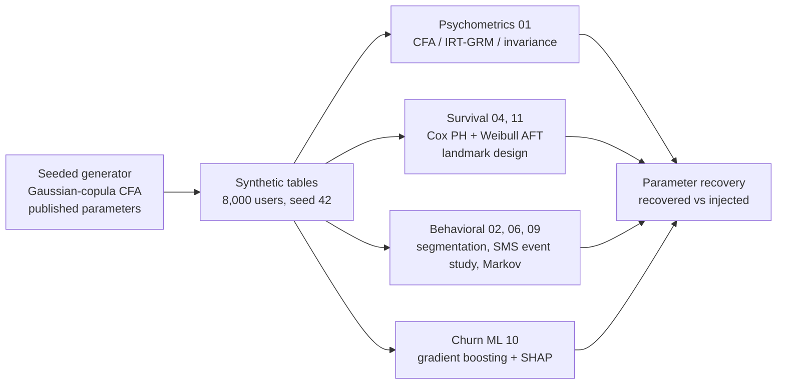

# Digital-health survival casebook

[](https://github.com/brittanyreese/digital-health-survival-casebook/actions/workflows/ci.yml)


[](https://github.com/astral-sh/ruff)

A reproducible methods casebook for **digital-health survival analysis**, built on a fully synthetic smoking-cessation cohort (8,000 app users, a ~480-user psychometric subsample, a ~1,200-user follow-up cohort, seed 42). One seeded generator draws its parameters from published literature and public federal data (NHANES, MMWR) and writes every table; the analysis pipeline recovers those injected parameters. Because the ground truth is known, each result is scored against it rather than argued from authority. The cohort and its fictional vendor are inventions with no real-study counterpart, and the results recover what the generator put in, not evidence about real users or whether any real app works.

It exists to make good method inspectable. mHealth research rarely connects engagement to clinical endpoints with statistically appropriate models (see [Context and motivation](#context-and-motivation)), and this shows the full, leakage-free way to do it, with the working code and honest bounds.

**What it demonstrates:** correct censoring and immortal-time handling (landmark design), leakage-free feature/label separation enforced in code, negative and positive controls, honest reporting of what parameter recovery does and does not prove, and reproducibility a CI job re-checks on freshly generated data.



## Context and motivation

Most published mHealth-cessation analyses stop at descriptive usage metrics (session counts, days active) and rarely connect engagement trajectories to clinical endpoints with survival-appropriate models. Engagement is multidimensional and poorly operationalized (Perski et al. 2017, *Transl Behav Med*), objective usage drops off far faster than self-report suggests (Baumel et al. 2019, *JMIR*), and adherence is seldom analyzed with the right estimators (Whittaker et al. 2019, Cochrane). This casebook builds the pipeline those gaps call for and runs it end to end on the synthetic cohort, so the method is the contribution.

## Analyses

| Analysis | Script |
|---|---|
| Psychometric validation: CFA, IRT-GRM, cross-group factor congruence, misspecification checks, MARS subscale reliability | `analysis/01_psychometrics.py` |
| Behavioral segmentation: KMeans, silhouette selection, log-rank retention | `analysis/02_segmentation.py` |
| Survival analysis: Cox PH + Schoenfeld test, Weibull AFT primary, right-censoring | `analysis/04_outcome_duration.py` |
| SMS re-engagement negative control: event study, logistic regression | `analysis/06_sms_reengagement.py` |
| Behavioral analytics: Markov channel transitions, stationary distributions, channel-outcome correlation | `analysis/09_golden_paths.py` |
| ML / XAI: HistGradientBoosting, ROC-AUC + AUPRC, SHAP, calibration, subgroup AUC | `analysis/10_churn_ml.py` |
| Landmark analysis: quit-date anchoring, AFT window sensitivity, Schoenfeld test | `analysis/11_quit_anchored.py` |
| Recovery stability: Monte-Carlo recovery intervals across independent seeds | `analysis/12_recovery_monte_carlo.py` |

## Analytical design decisions

Three choices address common mHealth-analytics pitfalls:

- **Immortal-time / landmark design (04, 10, 11).** Total engagement over the full follow-up is a biased predictor of duration: longer survivors accumulate more events by construction. Scripts 04 and 10 restrict engagement features to a pre-outcome baseline window (days 0-29); script 11 uses a landmark analysis (van Houwelingen 2007), excluding pre-window relapsers and shifting the time origin to day 30.
- **Proportional-hazards testing (04, 11).** Cox PH is fitted with a Schoenfeld residual test alongside the AFT primary. No violation is detected (script 04 minimum p = 0.32; script 11 minimum p = 0.086). Weibull AFT is pre-specified as primary regardless, since it needs no PH assumption.
- **Feature/label temporal separation (10).** Churn features come from days 0-29, the label from days 166-180; a runtime assertion enforces no overlap.

## Key results (synthetic data: parameter recovery only)

All values reflect how well the pipeline recovers the injected parameters. They do not generalize to real users. Each result is annotated with its implication for a real-data study design.

| Analysis | Synthetic result | Real-data implication |
|---|---|---|
| Weibull AFT (script 04) | exp(β) = 1.21 (95% CI 1.08–1.36), p = 0.0014, per log-unit 30-day engagement | The pipeline recovers the injected engagement→duration signal. The generator injects a latent-propensity coefficient (β on θ, not on log-events), so this exp(β) is the association θ induces through observed engagement, on a different scale from any single injected constant, not a literal read-back of it. The recoverable facts are the direction and its significance; the exact magnitude is a proxy-scale estimate, not the finding |
| Weibull AFT (script 11) | exp(β) = 1.27 (95% CI 1.06–1.53), p = 0.011; activated exp(β) = 0.81 (95% CI 0.53–1.25, p = 0.35, n.s.); n=336 post-landmark (139 early relapsers excluded at <30d); 172 events | Landmark exclusion removes the immortal-time variant; the engagement effect survives at moderate power. The funnel-nesting fix (registration ⊇ followup) lifted this cohort from an underpowered n=74 (27 events) to 336 (172 events); the activated segment contrast is non-significant, but it is partly collinear with log_n_events (same engagement signal), so this is not strong evidence of no segment effect |
| Weibull shape κ (scripts 04, 11) | κ = 0.59 (script 04, enrollment-anchored; 95% CI 0.55–0.63); κ = 0.86 (script 11, post-landmark; 95% CI 0.75–0.98); injected κ = 0.55 | Script 04's 0.59 recovers the injected decreasing-hazard shape (CI includes 0.55). Script 11's 0.86 is not a recovery of κ: left-truncating and origin-shifting a Weibull(0.55) leaves a residual-time distribution (T − 30 given T > 30) that is no longer Weibull and whose best-fit shape drifts toward 1. It describes the post-landmark conditional hazard, not the generative parameter; at n=336 it is estimated tightly enough that its CI now excludes 1 |
| Cox PH test (script 04) | All Schoenfeld p > 0.32; PH holds; Cox HR = 0.897 (95% CI 0.84–0.96; p = 0.0017, MLE; penalizer=0), directionally consistent with AFT | Aligned covariate sets enable direct Cox/AFT comparison; both significant in same direction |
| Cox PH test (script 11) | All 6 Schoenfeld p > 0.08 (minimum: mod_readiness p = 0.086); no PH violation detected at α = 0.05 | Weibull AFT is pre-specified as primary regardless; Cox uses the same parsimonious covariate set as AFT (log_n_events + activated + demographic moderators) for direct comparison |
| AFT window sensitivity (script 11) | exp(β) = 1.09 (p = 0.37, n=336) at 14d; exp(β) = 1.05 (p = 0.56, n=279) at 60d | Direction is stable (exp(β) > 1 at both widths) but significance is not retained in the reduced-specification windows; the effect does not strengthen monotonically toward wider windows as it did pre-landmark, which was the bias signature |
| CFA misspecification check (script 01) | CFI = 0.469 on 1-factor case (trivial misfit detected); CFI = 0.997 on correct 2-factor case; CFI = 1.003 on the "bifactor" case (`detects_hard=False`) | Pipeline detects trivial misfit. The "bifactor" case does not test what its name implies: with uniform loadings on the two item blocks it is observationally equivalent to a correlated-2-factor model (rank-1 blocks), so the good 2-factor fit is the correct answer, not a missed misspecification. A genuine bifactor stress-test needs specific factors that cross-cut the item blocks |
| CFA fit (script 01) | SDBS 2-factor: CFI = 0.981, RMSEA = 0.026 | Reflects parameter recovery fidelity; a real-data CFA on this instrument would face measurement noise, partial invariance, and potentially different factor structure across populations |
| Churn ROC-AUC (script 10) | 0.839 ± 0.009 (5-fold stratified CV) | Above published DHT benchmark range of 0.65–0.78; elevated because synthetic signal-to-noise is clean; real AUC would likely fall in that range |
| Churn AUPRC (script 10) | 0.342 ± 0.028 (no-skill baseline = 0.106) | 3.2x no-skill lift at 10.6% churn prevalence; AUPRC is the informative metric under class imbalance |
| Subgroup AUC (script 10) | Age: below-median 0.870, above-median 0.816; Education: below-median 0.845, above-median 0.837 | Modest performance gap by age and education on synthetic data; real fairness audit would require race/ethnicity, rurality, and insurance status |
| Channel-outcome association (script 09) | No channel significant (univariate Cox HR per unit 30-day time-share: quiz 2.05 p=0.16, content 1.34 p=0.31, others ≤ 1.0, all p > 0.15); full cohort n = 1162 (relapsers + censored) | Channel mix in the first 30 days shows no association with quit hazard (unadjusted univariate Cox; time-shares are compositional so HRs are not mutually independent; volume not controlled); channel effects require larger N and randomized exposure |
| Reengagement return (script 06) | reengaged ~ baseline engagement: OR = 1.34 per log-unit (95% CI 1.18–1.53), p < 0.001; n=853 delivered-SMS users, 215 returns | Positive control complementing the SMS negative control (delivered-vs-opted-out is null by construction). The generator injects a θ→14-day-return effect, and the pipeline recovers a positive engagement→return association through the observed engagement proxy; direction and significance are the recoverable facts, magnitude is proxy-scale, not causal |
| Monte-Carlo recovery (script 12, 25 seeds) | AFT exp(β) = 1.28 (MC 95% [1.17, 1.41]), positive in all 25 seeds; Weibull marginal shape κ = 0.59 (MC 95% [0.56, 0.64]) | The engagement→duration recovery is stable across independent draws, not a single-seed artifact. The κ interval sits just above the baseline injected 0.55 because individual frailty (the exp(lp) scale mixture) lifts the marginal shape, matching script 04's 0.59. A real replication would test exactly this stability; here it is guaranteed by construction, so the value is showing recovery is reproducible, not sample-specific |

All analyses are exploratory within a single synthetic dataset. No correction for multiple comparisons is applied across scripts. A pre-registered, FDR-controlled replication on real data would be required before any clinical interpretation.

## Synthetic data generation

Data are generated from a Gaussian-copula CFA model calibrated to:

- SDBS (Smoking Decisional Balance Scale, 20 items): Velicer et al. (1985). *J Pers Soc Psychol*, 48(5), 1279–1289.
- SSEQ-12 (Smoking Self-Efficacy Questionnaire): Etter et al. (2000). *Addiction*, 95(6), 901–913.
- TTM stage distribution: Prochaska et al. (1985). *Addict Behav*, 10(4), 395–406.
- Stage-conditional self-efficacy: DiClemente et al. (1985). *Cogn Ther Res*, 9(2), 181–200.
- Relapse kinetics (Weibull shape κ = 0.55): Hughes JR, Keely J, Naud S (2004). Shape of the relapse curve and long-term abstinence among untreated smokers. *Addiction*, 99(1), 29–38.
- SMS opt-out (48% by 6 months): Christofferson DE, Hertzberg JS, Beckham JC, Dennis PA, Hamlett-Berry K (2016). Engagement and abstinence among users of a smoking cessation text message program for veterans. *Addictive Behaviors*, 62, 47–53. PMC5144826.
- Demographics: CDC NHANES 2017–March 2020 pre-pandemic cycle (SMQ, P_SMQ.xpt); Cornelius ME, Wang TW, Jamal A, Loretan CG, Neff LJ (2020). Tobacco Product Use Among Adults, United States, 2019. *MMWR Morb Mortal Wkly Rep*, 69(46), 1736–1742.

## Reproduce

```bash
# Install uv: brew install uv, pipx install uv, or see
# https://docs.astral.sh/uv/getting-started/installation/
uv sync

# Generate all synthetic tables (~30 seconds)
uv run cessation-generate

# Validate distributional properties against calibration targets
uv run cessation-validate

# Run analyses in order (02 must precede 04, 06, 09, 10, 11)
uv run python analysis/01_psychometrics.py
uv run python analysis/02_segmentation.py
uv run python analysis/04_outcome_duration.py
uv run python analysis/06_sms_reengagement.py
uv run python analysis/09_golden_paths.py
uv run python analysis/10_churn_ml.py
uv run python analysis/11_quit_anchored.py
```

Recovery is stable across seeds, not a single-draw artifact: `uv run python analysis/12_recovery_monte_carlo.py` regenerates the survival flagship over 25 independent seeds and reports Monte-Carlo recovery intervals (slow, ~7 minutes; run once, output committed, not on the CI hot path).

Results (figures + CSV tables) appear in `results/analysis/`. `data/synthetic/generation_metadata.json` records the seed, package and platform versions, table row counts, and all citation keys used at generation time.

Under seed 42 the result CSV tables are byte-identical across runs. Figures are not held to that standard: one SHAP summary plot (`results/analysis/10_fig_shap_summary.png`) varies by about 0.35% between runs, from nondeterminism in the SHAP and matplotlib rendering path. The committed tables were generated on macOS/ARM; regeneration on another platform (the Linux CI, for instance) can differ in trailing digits.

## Synthetic data disclosure

`data/synthetic/` is entirely generated from published parameters; no real participant data are present. Because the data are generated from the same structure the analyses then recover, fit indices, IRT parameters, and effect sizes reflect recovery fidelity, not real-world validity. Specific caveats:

- **CFA / IRT (01):** fit is good by construction. The section-7 misspecification check confirms the pipeline detects a wrong (1-factor) model (CFI 0.469 vs 0.997 for the correct 2-factor). Its "bifactor" case (CFI 1.003) is observationally equivalent to a correlated-2-factor model, so the good fit there is the correct answer, not a missed misspecification. EFA retains only 1 factor for the SSEQ (injected inter-factor r = 0.79), so the 2-factor SSEQ CFA is imposed, not confirmed.
- **Survival (04, 11):** Cox and AFT agree in direction and significance (04: HR 0.897, AFT exp(β) 1.21). Script 11's ridge-shrunk HRs are directional only, and OLS on log-duration is biased (treats censored as failures), shown for interpretability only. Demographic moderators are generated independently of the outcome, so their ~1.0 coefficients are expected and do not shift the engagement estimate.
- **Cohort (11):** the funnel-nesting fix (registration ⊇ followup) lifted the landmark cohort from n=74 to 336. Registration is drawn independently of engagement (corr ≈ 0), so this restores power on missing-at-random dropout; it is not de-biasing, and the 2.08→1.27 attenuation is variance from the old 27-event cell, not removed selection.
- **ML (10):** the 0.839 AUC reflects clean synthetic signal; real DHT churn benchmarks fall in 0.65–0.78. The subgroup-AUC fairness cut covers only age and education.
- **Benchmarks** are context, not validation. mHealth 6-month abstinence runs ~15–30% vs ~3–5% control (Whittaker et al. 2019, Cochrane CD006611, which reports pooled risk ratios, not raw percentages).
- **Scope:** exploratory on a single synthetic dataset with no multiple-comparison correction. Real-data use would require prospective design, endogeneity and missingness handling, pre-registration, and FDR control before any clinical reading.

## Citing

If you use this casebook, cite it via the [`CITATION.cff`](CITATION.cff) file; GitHub's "Cite this repository" button generates APA and BibTeX from it. The methods and calibration sources are listed with DOIs in [docs/REFERENCES.md](docs/REFERENCES.md).

## License

MIT. See [LICENSE](LICENSE).

## AI assistance

Built with AI coding tools under the review, testing, and parameter-recovery validation gates in [CONTRIBUTING](CONTRIBUTING.md#ai-assistance). The maintainer makes the design decisions and validates every result against those references.
